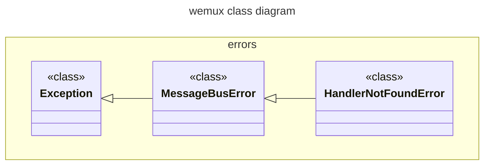
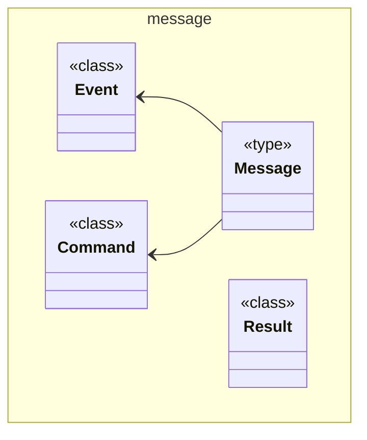
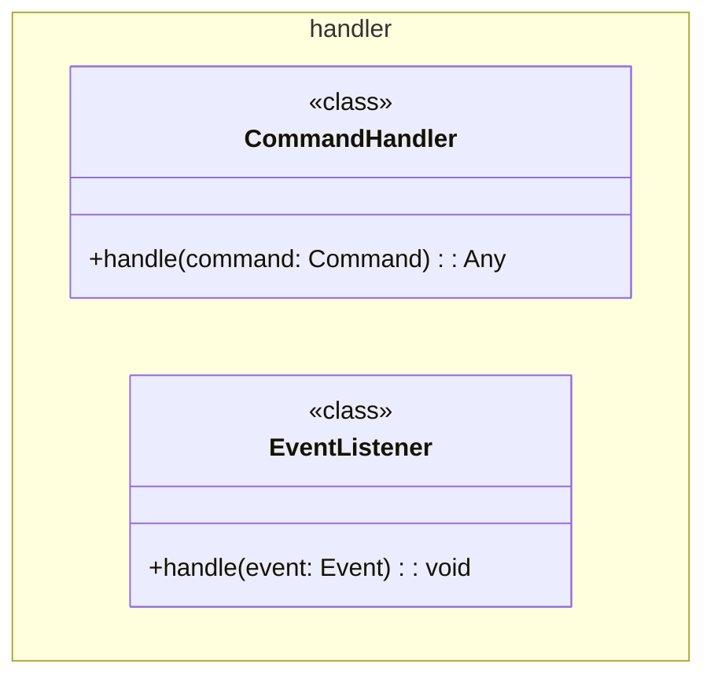
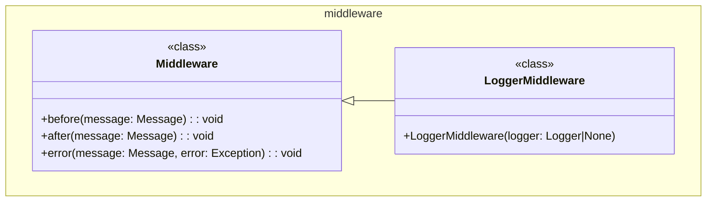
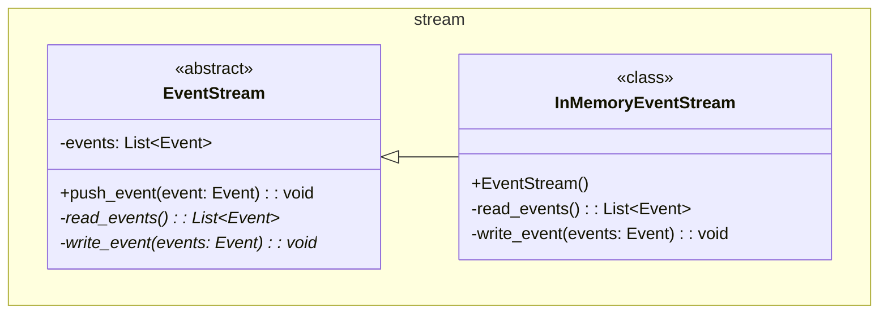
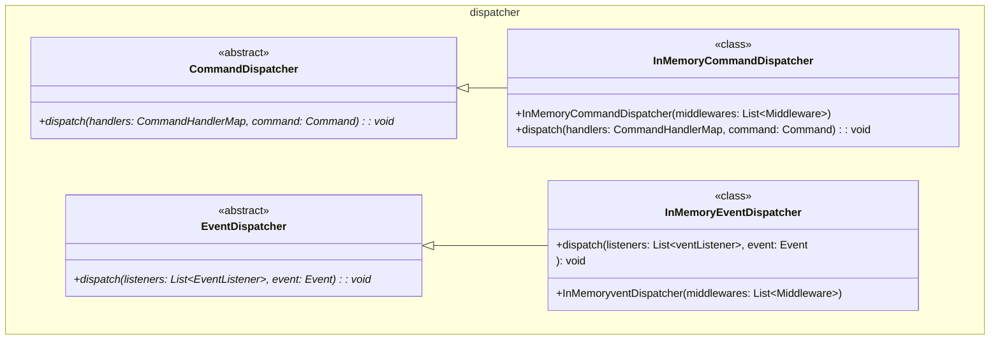
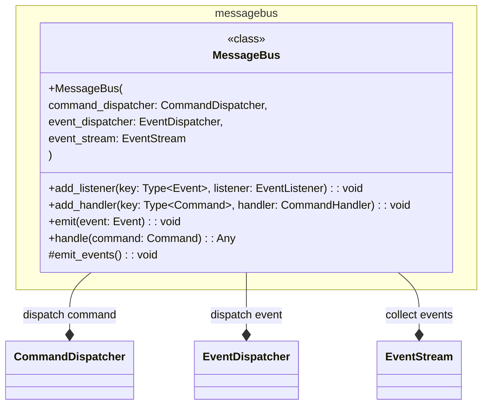

```mermaid
---
title: wemux class diagram
---

classDiagram
    namespace errors {
        class Exception {
            <<class>>
        }

        class MessageBusError {
            <<class>>
        }
        class HandlerNotFoundError {
            <<class>>
        }
    }
    Exception <|-- MessageBusError
    MessageBusError <|-- HandlerNotFoundError
```

```mermaid
classDiagram
    namespace message {
        class Event {
            <<class>>
        }

        class Command {
            <<class>>
        }

        class Message {
            <<type>>
        }

        class Result {
            <<class>>
        }
    }
    Event <-- Message
    Command <-- Message
```

```mermaid
classDiagram
    namespace handler {
        class CommandHandler {
            <<class>>
            +handle(command: Command): Any
        }

        class EventListener {
            <<class>>
            +handle(event: Event): void
        }
    }
```

```mermaid
classDiagram
    namespace middleware {
        class Middleware {
            <<class>>
            +before(message: Message): void
            +after(message: Message): void
            +error(message: Message, error: Exception): void
        }

        class LoggerMiddleware {
            <<class>>
            +LoggerMiddleware(logger: Logger|None)
        }
    }
    Middleware <|-- LoggerMiddleware
```

```mermaid
classDiagram
    namespace stream {
        class EventStream {
            <<abstract>>
            -events: List~Event~
            +push_event(event: Event): void
            -read_events(): List~Event~*
            -write_event(events: Event): void*
        }

        class InMemoryEventStream {
            <<class>>
            +EventStream()
            -read_events(): List~Event~
            -write_event(events: Event): void
        }
    }
    EventStream <|-- InMemoryEventStream
```

```mermaid
classDiagram
    namespace dispatcher {
        class CommandDispatcher {
            <<abstract>>
            +dispatch(handlers: CommandHandlerMap, command: Command): void*
        }

        class EventDispatcher {
            <<abstract>>
            +dispatch(listeners: List~EventListener~, event: Event): void*
        }

        class InMemoryCommandDispatcher {
            <<class>>
            +InMemoryCommandDispatcher(middlewares: List~Middleware~)
            +dispatch(handlers: CommandHandlerMap, command: Command): void
        }

        class InMemoryEventDispatcher {
            <<class>>
            +InMemoryventDispatcher(middlewares: List~Middleware~)
            +dispatch(listeners: List~ventListener~, event: Event
            ): void
        }
    }
    CommandDispatcher <|-- InMemoryCommandDispatcher
    EventDispatcher <|-- InMemoryEventDispatcher
```

```mermaid
classDiagram
    namespace messagebus {
        class MessageBus {
            <<class>>
            +MessageBus(
            command_dispatcher: CommandDispatcher,
            event_dispatcher: EventDispatcher,
            event_stream: EventStream
            )
            +add_listener(key: Type~Event~, listener: EventListener): void
            +add_handler(key: Type~Command~, handler: CommandHandler): void
            +emit(event: Event): void
            +handle(command: Command): Any
            #emit_events(): void
        }
    }

    MessageBus --* CommandDispatcher: dispatch command
    MessageBus --* EventDispatcher: dispatch event
    MessageBus --* EventStream: collect events
```